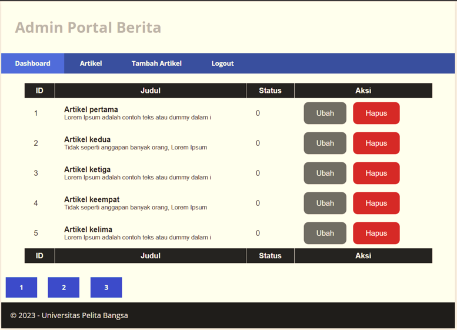
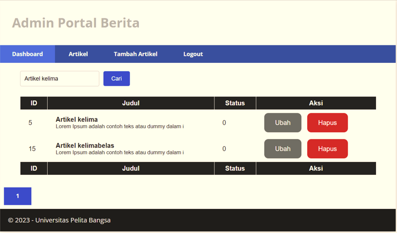

# Tugas Pemograman Web 2
# Praktikum 10: Pagination dan Pencarian

```bash
Nama    : Nafal Mumtaz Fuadi
Kelas   : TI.21.A.2
Nim     : 312110457
```

## Output

```bash
Output terbaru dengan adanya tampilan pagination dan Pencarian
```

# Langkah-langkah & Persiapan
## Membuat Pagination
<p>Pagination merupakan proses yang digunakan untuk membatasi tampilan yang panjang
dari data yang banyak pada sebuah website. Fungsi pagination adalah memecah tampilan
menjadi beberapa halaman tergantung banyaknya data yang akan ditampilkan pada
setiap halaman.</p>
<p>Pada Codeigniter 4, fungsi pagination sudah tersedia pada Library sehingga cukup mudah
menggunakannya.</p>

- Untuk membuat pagination, buka kembali Controller Artikel, kemudian modifikasi kode pada method admin_index seperti berikut.

```php
public function admin_index()
{
$title = 'Daftar Artikel';
$model = new ArtikelModel();
$data = [
'title' => $title,
'artikel' => $model->paginate(10), #data dibatasi 10 record
per halaman
'pager' => $model->pager,
];
return view('artikel/admin_index', $data);
}
```

- Kemudian buka file views/artikel/admin_index.php dan tambahkan kode berikut dibawah deklarasi tabel data.

```php
<?= $pager->links(); ?>
```

- Selanjutnya buka kembali menu daftar artikel, tambahkan data lagi untuk melihat hasilnya.



## Membuat Pencarian
<p>Pencarian data digunakan untuk memfilter data.</p><br>
- Untuk membuat pencarian data, buka kembali Controller Artikel, pada method admin_index ubah kodenya seperti berikut.

```php
    public function admin_index()
    {
        $title = 'Daftar Artikel';
        $q = $this->request->getVar('q') ?? '';
        $model = new ArtikelModel();
        $data = [
            'title' => $title,
            'q' => $q,
            'artikel' => $model->like('judul', $q)->paginate(5), # data dibatasi 10 record per halaman
            'pager' => $model->pager,
        ];
        return view('artikel/admin_index', $data);
    }
```

- Kemudian buka kembali file views/artikel/admin_index.php dan tambahkan form pencarian sebelum deklarasi tabel seperti berikut:

```php
  <form method="get" class="form-search">
    <input type="text" name="q" value="<?= $q; ?>" class="text-search" placeholder="Cari data">
    <input type="submit" value="Cari" class="submit-search">
  </form>
```

- Dan pada link pager ubah seperti berikut.

```php
<?= $pager->only(['q'])->links(); ?>
```

- Selanjutnya uji coba dengan membuka kembali halaman admin artikel, masukkan kata kunci tertentu pada form pencarian.



## Pertanyaan dan Tugas
<p>Selesaikan programnya sesuai Langkah-langkah yang ada. Anda boleh melakukan improvisasi.</p>

## Laporan Praktikum
1. Melanjutkan praktikum sebelumnya pada repository dengan nama Lab9Web.
2. Kerjakan semua latihan yang diberikan sesuai urutannya.
3. Screenshot setiap perubahannya.
4. Update file README.md dan tuliskan penjelasan dari setiap langkah praktikum beserta
screenshotnya.
5. Commit hasilnya pada repository masing-masing.
6. Kirim URL repository pada e-learning ecampus.

## Terima Kasih!